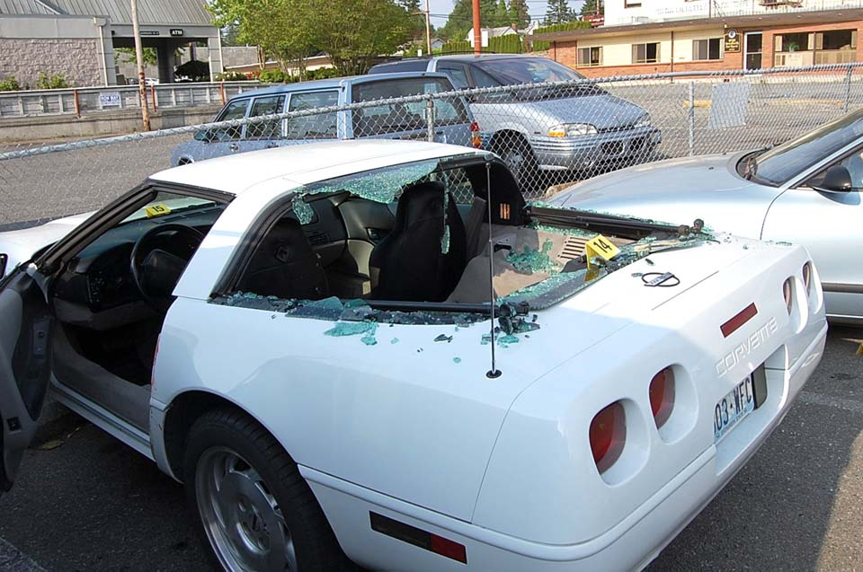
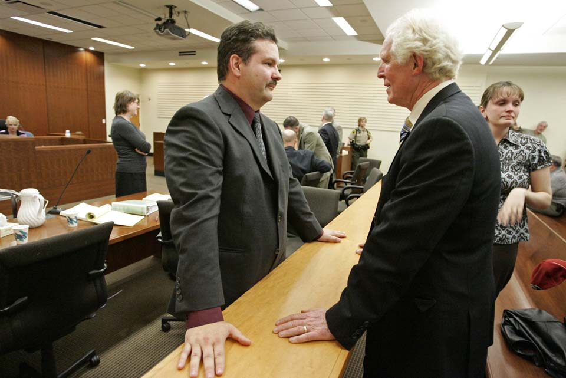

Killings by police in the line of duty have surged in Washington over the past decade, according to a Seattle Times analysis. 

During that period, only one police officer has been criminally charged in state courts with the illegal use of deadly force on the job.

In fact, that case is the only one to be brought in the three decades since Washington enacted the nation's most restrictive law on holding officers accountable for the unjustified use of deadly force.

In 1986, Washington's Legislature decided police officers shouldn't be prosecuted for killing someone in the line of duty as long as they acted in good faith and without malice, or what the law calls "evil intent."

<aside class="pullquote sidebar tweet" data-tweet="&quot;This almost perfect defense to a mistaken use of force has kept police officers out of court.&quot;">
  &ldquo;This <b>almost perfect defense</b> to a mistaken use of force <b>has kept police officers out of court</b> as defendants.&rdquo;<i class="fa fa-twitter"></i>
</aside>

"This almost perfect defense to a mistaken use of force has kept police officers out of court as defendants," King County Prosecutor Dan Satterberg has said.

The Times analyzed 212 fatal police encounters from 2005 to 2014. Although the vast majority of the cases were deemed legally justified, others were controversial. But with the malice and good faith requirements, it was nearly impossible for prosecutors to bring criminal charges even if they concluded that an officer committed a wrongful killing.

<aside class="image">
  
  

    Niles Meservey was drunk in this car when Everett police Officer Troy Meade fatally shot him in the back in 2009 outside a restaurant. Meade said he feared the car was going to back over him. (Photo by Paul Luvera via The Associated Press)
  

</aside>

In the lone case, an Everett police officer was charged with second-degree murder and manslaughter after he fatally shot a drunken man through the rear window of his car in 2009.

A Snohomish County jury, instructed to consider whether he acted with malice, acquitted the officer. 

The Times also determined that a disproportionate number of the 212 deaths were African Americans &mdash; a troubling finding as the nation wrestles with a spate of police encounters that have led to the deaths of unarmed African Americans, spawning the "[Black Lives Matter](http://blacklivesmatter.com/)" movement. 

Prosecutors from the state's 39 counties, some concerned about the justifiable police homicide statute, will discuss whether to have the law changed at an Oct. 1 public meeting of the Washington Association of Prosecuting Attorneys.

## By the numbers

Just how often police kill citizens in the line of duty and under what circumstances is difficult to determine. While the FBI collects data nationally on justifiable homicides by police, law-enforcement agencies are not required to submit the incidents. According to studies, the FBI totals each year are significant undercounts and unreliable. 

To authoritatively examine the issue in Washington, The Times used public-records requests, death certificates, interviews and other research to collect, measure and analyze a decade of killings by police in the state's 39 counties. 

The numbers of people killed by police from 2005 to 2009 averaged 16 deaths per year. From 2010 to 2014, it averaged 27 per year. 

  <em>With these questions, explore the data behind the 212 deaths:</em>
  <!-- Weapons -->
  <aside class="question-box weapon">
    <%= t.include("_question.html", {
      title: "How many people killed by police do you think possessed a weapon?",
      filter: "firearm",
      options: [
        { data: "34%" },
        { data: "52%" },
        { data: "74%" },
        { data: "84%", correct: "correct" }
      ],
      key: "Weapon",
      sort: "weapon",
      toggles: [
        { data: "firearm", label: "Firearm (51.4%)", selected: "selected" },
        { data: "fake", label: "Fake gun (4.7%)" },
        { data: "knife", label: "Knife/blade (16.5%)" },
        { data: "vehicle", label: "Vehicle (5.7%)" },
        { data: "other", label: "Other (5.7%)" },
        { data: "no-weapon", label: "No weapon (16%)" }
      ],
      explanation: "Half of the 212 people killed by police had a firearm in their possession. Another 10 had fake guns that could have been mistaken for actual firearms. Others had such weapons as a cane, baseball bat or pool cue. Thirty-four had no weapon."
    }) %>
  </aside>

  <!-- Age -->
  <aside class="question-box age">
    <%= t.include("_question.html", {
      title: "How many do you think were teenagers?",
      filter: "age-0",
      options: [
        { data: "3%", correct: "correct" },
        { data: "8%" },
        { data: "15%" },
        { data: "28%" }
      ],
      key: "Age",
      sort: "age",
      toggles: [
        { data: "age-0", label: "0-19 (3.3%)", selected: "selected" },
        { data: "age-20", label: "20-29 (31.1%)" },
        { data: "age-30", label: "30-39 (26.9%)" },
        { data: "age-40", label: "40-49 (20.8%)" },
        { data: "age-50", label: "50-59 (12.3%)" },
        { data: "age-60", label: "60-69 (4.2%)" },
        { data: "age-70", label: "70+ (1.4%)" }
      ],
      explanation: "Just seven of the deaths were teenagers. The youngest person was 16, the oldest 77. Nearly 40 percent were 40 or older. Only three of the 212 people killed by police were women."
    }) %>
  </aside>

  <!-- Time of day -->
  <aside class="question-box time">
    <%= t.include("_question.html", {
      title: "How many fatal encounters do you think happened during the afternoon?",
      filter: "time-12",
      options: [
        { data: "10%" },
        { data: "15%" },
        { data: "25%", correct: "correct" },
        { data: "30%" }
      ],
      key: "Time of day",
      sort: "hour",
      toggles: [
        { data: "time-0", label: "<i class='fa fa-moon-o'></i> Midnight - 6 a.m. (21.7%)" },
        { data: "time-6", label: "<i class='fa fa-sun-o'></i> 6 a.m. - noon (16%)" },
        { data: "time-12", label: "<i class='fa fa-sun-o'></i> Noon - 6 p.m. (25%)", selected: "selected" },
        { data: "time-18", label: "<i class='fa fa-moon-o'></i> 6 p.m. - midnight (36.3%)" }
      ],
      explanation: "While evening hours saw the highest number of fatal police encounters, 25 percent of incidents occurred in the afternoon, with another 16 percent occurring earlier in the day."
    }) %>
  </aside>

In 84 percent of the cases, police officers who used deadly force in Washington confronted people who had a weapon, typically a firearm. 

Only three of the 212 were female, and seven were in their teens. Nearly 41 percent occurred during the day, defined as 6 a.m. to 6 p.m.

Some numbers underscore the national concerns about deadly force. 

<aside class="pullquote sidebar tweet" data-tweet="Ten percent of those killed by police were black, a group that accounts for 3.6 percent of the state's population.">
  <b>Ten percent</b> of those killed by police were black, a group that accounts for <b>3.6 percent</b> of the state's population. <i class="fa fa-twitter"></i>
</aside>

About 10 percent of those killed were black, a group that accounts for 3.6 percent of the state’s population. Blacks were also overrepresented among those without a weapon, accounting for nearly 15 percent of that group.

In King County, where blacks represent 6.3 percent of the population, they accounted for more than 20 percent of deaths. 

Satterberg said he saw the recent videos of police encounters nationwide that "make you sick." He said it's no surprise these "awful but lawful" cases have people demanding change.

The law's malice language creates a bar that is "almost impossible to get over" and is difficult to explain to the public, Satterberg, president of the prosecutors association, said in a recent interview. 

<!-- Williams -->
<aside class="inline-video">
  <%= t.include("_brightcove.html", { id: 715145081001 }) %>
  

    An SPD dashboard video shows woodcarver John T. Williams crossing a Seattle street moments before being shot by Officer Ian Birk on Aug. 30, 2010.
  

</aside>

In Seattle, for example, the 2010 shooting of John T. Williams sparked outrage when [patrol-car video and audio](http://www.seattletimes.com/seattle-news/police-video-documents-fatal-encounter-between-officer-and-woodcarver/) revealed then-officer Ian Birk had given the First Nations woodcarver about four seconds to drop a knife before opening fire.

The Police Department [found the shooting unjustified](http://www.seattletimes.com/seattle-news/officer-birk-quits-after-spd-rebuke/) under its policies, Birk resigned and the city paid Williams' family $1.5 million. The fallout from the shooting led  in part to the [U.S. Justice Department demands](http://www.seattletimes.com/seattle-news/spd-faces-new-oversight-scrutiny-of-use-of-force/) that  Seattle police adopt reforms to curb excessive force.

But no criminal charges were filed, which caused some community outcry. Despite believing Birk misread the situation, Satterberg decided his office wouldn't be able to prove beyond a reasonable doubt that Birk acted with malice and bad faith and didn't have a "subjective belief" he needed to defend himself.

In Pasco recently, the Franklin County prosecutor came to a similar conclusion after Pasco police officers fatally shot Antonio Zambrano-Montes, a man who had been throwing rocks. That decision also sparked protest. 

## Spokane beating

Well before the recent national focus on questionable law-enforcement shootings, the issue of whether police can effectively be held accountable in Washington was raised by the homicide of Otto Zehm, an unarmed, mentally challenged man in Spokane.

In a state with a less-restrictive law for justifiable police homicide, the [Zehm case](http://www.seattletimes.com/seattle-news/spokane-excessive-force-saga-may-hold-lessons-for-seattle/) might well have resulted in local criminal charges against an officer.

<!-- Zehm -->
<aside class="inline-video">
  <%= t.include("_brightcove.html", { id: 1344652387001 }) %>
  

    Surveillance video captures Spokane police Officer Karl Thompson Jr. beating Otto Zehm in a convenience store. (Video courtesy of KING 5)
  

</aside>

Zehm, 36, only wanted a candy bar and a soft drink when he entered a Spokane convenience store named Zip Trip in 2006.

A few minutes behind him was Spokane police Officer Karl Thompson Jr., responding to a report, later proved false, that Zehm might have stolen money from a cash machine.

Thompson raised his baton and hurried to Zehm, who was holding a 2-liter plastic bottle of Diet Pepsi. Without questioning Zehm, Thompson twice struck the man in the head. Zehm collapsed to the floor and curled into the fetal position. 

Standing over him, Thompson fired Taser probes into Zehm's chest, then smashed him with at least seven more baton strikes. Several other officers hogtied Zehm and held him on his stomach.

Zehm, 36, ended up in a coma and died two days later after his ventilator was turned off. His last words in the store: "All I wanted was a Snickers bar." 

Thompson would later say he felt threatened by Zehm's soda bottle. 

On its face, the death of Zehm appeared to be terrible police work. In addition, Thompson, trying to protect his career, interfered with the death investigation. Even so, Steve Tucker, Spokane County prosecutor at the time, chose not to bring charges against Thompson and other officers on the scene. 

Only later did the federal Justice Department indict Thompson on a criminal civil-rights charge and for obstructing the investigation. After studying security-camera video of the March 18, 2006, incident, [jurors found Thompson guilty](http://www.justice.gov/opa/pr/spokane-wash-police-officer-convicted-civil-rights-and-obstruction-violations-connection) of using excessive force and obstruction. He was sentenced to 51 months in a federal prison.

## Supreme Court ruling

Much of how and when police can use deadly force today stems from a 1985 U.S. Supreme Court decision about the killing of Edward Garner, an unarmed 15-year-old in Memphis, Tenn., suspected of being a prowler. 

Responding to a night police call, an officer shined his flashlight on Garner in a fenced backyard, determined he was unarmed and told him to halt. When the 100-pound teen tried to climb a 6-foot fence and flee, Officer Elton Hymon shot him in the back of the head, killing him. 

The Supreme Court ruled that using deadly force to prevent the escape of an unarmed suspect violated his constitutional rights. 

<aside class="pullquote sidebar tweet" data-tweet="In a state with a less-restrictive law, Spokane’s Otto Zehm case may have resulted in criminal charges against an officer.">
  In a state with a less-restrictive law, Spokane’s Otto Zehm case <b>may have resulted in criminal charges against an officer</b>. <i class="fa fa-twitter"></i>
</aside>

The [Garner decision](https://supreme.justia.com/cases/federal/us/471/1/case.html) established that police could use deadly force to apprehend a suspect only when they had a belief they or others faced a significant threat of death or serious injury. 

In Seattle, [the Garner decision was condemned](https://www.documentcloud.org/documents/2426497-deadlyforce.html) by Bill Conn, who was president of the Seattle Police Officers' Guild. "If you can't shoot fleeing felons, then you are relegated to a foot chase and being expert at karate and jiu jitsu and all that exotic stuff you see in the movies and on television," he said.

Leo Poort, legal adviser to the Seattle police chief then, said the Garner decision was a "sea change" for officers. "It was a kind of a shock. It was so different from how they'd been trained," Poort said in a recent interview. 

Only about half the states had laws in line with the Garner ruling. In Washington, killing a fleeing suspect had been a justifiable police homicide since 1909. In the wake of Garner, police unions and conservative lawmakers resisted bringing Washington law in line. 

<!-- Audio -->
<aside class="audio sidebar">
  <%= t.include("_audio.html") %>
</aside>

In 1985, state Sens. Phil Talmadge, D-Seattle, chairman of the Senate Judiciary Committee, and George Fleming, D-Seattle, co-sponsored a bill that they hoped would help cities avoid costly wrongful-death lawsuits while protecting lives.

"The concept that the officer has to perceive he or she is in peril or someone else is in peril and then the use of deadly force is merited &mdash; that's not an unreasonable standard," Talmadge recently recalled. 

"But back then that was shocking for many."

The Washington Association of Sheriffs and Police Chiefs already had studied the issue for more than a year. The group presented a bill that limited use of deadly force except for cases that involved those suspected of dangerous crimes such as murder, rape and robbery.

But Talmadge and Fleming faced heavy opposition from senators who were adamant that police officers should have the power to use deadly force to stop a fleeing suspect of any crime. 

"Now, crime begets crime," Sen. Kent Pullen, R-Kent, said in debate on the floor. "And theft leads to burglary, burglary leads to robbery, robbery leads to murder. ... Passing a bill like this is telling the criminal that ‘We're condoning your crimes and you don't have to worry about any sort of penalty.'" 

Fleming, the first African American to serve in the state Senate, countered: "Just because a person is running down the street with a TV in his arm, shouldn't give you reason to blow him away!"

"Let's not put that kind of price ... on life. Life is too precious."

A year earlier in a resolution to the Legislature, the sheriffs and chiefs association included language that gave police protection from criminal liability if "acting in good faith." The same year, a law was enacted that provided peace officers with immunity when making an arrest for violation of a domestic violence order if acting "in good faith and without malice."

As Talmadge's and Fleming's deadly force bill was being hashed out, nearly identical wording was included in the proposed legislation. But the bill failed to pass.

Talmadge and Fleming tackled the issue again during the next Legislative session.

This time, rather than limiting when police could use deadly force by the types of suspected crimes, lawmakers substituted general language that allowed deadly force when a suspect posed a threat of serious physical harm to an officer or others. The words "good faith" and "malice" from the earlier bill remained. This bill passed the Legislature and [became a law in 1986.](http://apps.leg.wa.gov/rcw/default.aspx?cite=9A.16.040)

Poort, now retired from the Seattle Police Department, said he and the sheriffs and chiefs association can take credit for making sure those words ended up in the bill. 

"We wanted it clear that if you were acting in good faith, that a prosecutor should not be able to charge a crime," he said. But police wanted even further protection from prosecutors. "We did not want them to even come at all close," Poort explained. That was ensured, he said, by first requiring malice to bring criminal charges. 

The law, he said, "was not intended to be a free pass for taking someone's life."

## Snohomish County shooting

Snohomish County Prosecutor Mark Roe believed he and his team had what they needed to bring the first homicide case against a cop since the restrictive 1986 law. 

His office brought charges of second-degree murder and first-degree manslaughter against Everett police Officer Troy Meade in the fatal shooting in 2009 of Niles Meservey, 51.

<aside class="image">
  
  

    Everett police Officer Troy Meade, left, is greeted by Everett Police Chief Jim Scharf moments after Meade was found not guilty of murder and manslaughter for shooting a drunken driver in the back. He was later fired for violating department policy about deadly force. (John Lok/The Seattle Times)
  

</aside>

Meade had responded to reports that a drunken driver was attempting to drive away from the parking lot of Everett's Chuckwagon Inn. 

The prosecution's case rested largely on another officer at the scene. He testified that he never believed he, Meade nor nearby citizens were in imminent danger of death or serious injury.

The officer quoted Meade as saying, "Enough is enough. Time to end this," then opening fire.

Roe and his team sought to show malice with those words.

At his trial, Meade told jurors that Meservey refused commands to get out of his car, which was parked between two other vehicles.

Meade said he feared the car was about to back up and hit him, so he shot the man in the back.

A Snohomish County jury &mdash; given jury instructions that included the law's malice, or evil intent, language &mdash; found Meade [not guilty](http://www.seattletimes.com/seattle-news/jury-acquits-everett-officer-of-murder-manslaughter/) of either charge. He was later fired for violating department policy about deadly force.

## ‘Most egregious'

In a [June report](https://www.amnestyusa.org/sites/default/files/aiusa_deadlyforcereportjune2015.pdf), "Deadly Force: Police Use of Lethal Force in the United States," Amnesty International found Washington state's good faith and malice language stood alone among the 50 states.

"Washington &mdash; it's the most egregious," said Jamira Burley, an Amnesty International official who handles gun violence and criminal justice issues.

<!-- Map -->
<aside class="map">
  <%= t.include("_map.html") %>
</aside>

[Jeff Robinson](http://www.seattletimes.com/seattle-news/transformation-ahead-says-seattle-lawyer-chosen-for-aclu-national-leadership/), a longtime Seattle defense attorney who directs The Center for Justice of the national American Civil Liberties Union, wants the law changed. 

Putting himself in the mind of the police officer, he explained: "Unless you can demonstrate that I have this evil motive, I'm not guilty."

Speaking as a lawyer, he said, "It is virtually a license to kill." 

Even without the malice element, he noted, Washington would still have one of the country's strongest self-defense laws: Citizens and police can mistakenly use deadly force and not be charged as long as their actions are reasonable.

"Why do they need more than that?" Robinson asked. 

The policy reasons for the law are understandable, Prosecutor Satterberg said. Police are expected to "run toward danger," make split-second decisions and put themselves at risk, meaning they will make mistakes, he said. Fear of prison over a mistake might create "timid" officers. 

Satterberg declined to reveal his own position on changing the law, saying he did not want to get ahead of the prosecutors association.

If only the malice language were removed, Satterberg said, it might not make a difference because proving lack of good faith is still a high bar.

The ACLU of Washington wants the law changed regardless. 

When Pasco police were not charged earlier this month after the homicide of rock-wielding Zambrano-Montes, executive director Kathleen Taylor said: 

"The current law makes prosecutors exceedingly unwilling to file charges against police and thereby makes it almost impossible to hold police accountable for wrongfully killing civilians."

## Change the law?

<aside class="pullquote sidebar tweet" data-tweet="&quo;We have to be careful here and not try to quench some national desire for a sacrificial cop by changing the law until we can convict somebody.&quo;">
  &ldquo;We have to be careful here and not try to quench some national desire for a sacrificial cop by changing the law until we can convict somebody&rdquo; <i class="fa fa-twitter"></i>
</aside>

When Roe, Satterberg and other prosecutors meet Oct. 1 in Tacoma, they will consider whether to recommend changing the law. 

Roe, the only prosecutor who actually brought a murder charge against a cop, leans against changing the law. 

"We have to be careful here and not try to quench some national desire for a sacrificial cop by changing the law until we can convict somebody," he said. 

Tom McBride, executive secretary of the prosecutors association, said there are three options. 

They could recommend to the Legislature that the malice element be eliminated. 

Or without making a formal recommendation, they could ask the Legislature to review the law's language to decide if it should be changed, McBride said. 

They could recommend the current law remain unchanged. 

That would still leave Washington, in McBride's words, as an "outlier." 
